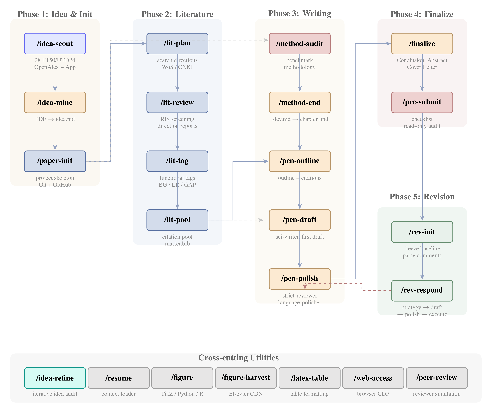

# Academic Paper Writing Skills (Claude Code)

A modular skill system for [Claude Code](https://docs.anthropic.com/en/docs/claude-code) covering the full academic paper lifecycle — from idea discovery to revision response.

<p align="center">
  
</p>

## Pipeline Overview

The pipeline spans 5 phases + cross-cutting utilities. Each skill is invoked via slash command (e.g., `/lit-plan`) in Claude Code.

### Phase 1: Idea & Init

| Skill | Description |
|:------|:------------|
| `/idea-scout` | Scan 28 FT50/UTD24 journals via OpenAlex API, translate abstracts, push to [Idea Scout App](https://zylen97.github.io/idea-scout/) for browsing & selection |
| `/idea-mine` | Deep-dive selected PDFs to extract transferable research ideas, output `idea.md` |
| `/paper-init` | Initialize project skeleton: publisher templates + Git/GitHub + 3-layer document system |

### Phase 2: Literature

| Skill | Description |
|:------|:------------|
| `/lit-plan` | Plan search directions, generate Web of Science / CNKI queries with quota allocation |
| `/lit-review` | Screen RIS exports, generate per-direction and summary reports |
| `/lit-tag` | Tag screened papers by function (BG/LR/GAP/...), classify by research question |
| `/lit-pool` | Aggregate tagged papers into citation pool with usage scenarios + `master.bib` |

### Phase 3: Writing

| Skill | Description |
|:------|:------------|
| `/method-audit` | Benchmark against published papers, audit methodology issues |
| `/method-end` | Distill mature dev files (`_dev.md`) into publication-ready chapter markdown |
| `/pen-outline` | Interactively build section outlines (arguments + citations) |
| `/pen-draft` | Generate first draft from outline via journal-scout + parallel sci-writer agents |
| `/pen-polish` | Iterative polish: strict-reviewer → user confirm → revise → language-polisher |

### Phase 4: Finalize

| Skill | Description |
|:------|:------------|
| `/finalize` | Four-step wrap-up: Conclusion → Abstract → Cover Letter → Structure cleanup |
| `/pre-submit` | Pre-submission checklist: citation integrity, self-citation rate, formatting, symbol consistency |

### Phase 5: Revision

| Skill | Description |
|:------|:------------|
| `/rev-init` | Initialize revision workflow: freeze baseline → parse decision letter → cluster comments |
| `/rev-respond` | Per-comment response loop: strategy alignment → draft → polish → execute |

### Cross-cutting Utilities

| Skill | Description |
|:------|:------------|
| `/idea-refine` | Interactive idea & method design iteration (idea-reviewer audit → revise → loop until satisfied) |
| `/resume` | Quick-load project context for new sessions |
| `/figure` | Academic figure workflow: auto-select TikZ/Python/R, create or beautify, Eagle style reference |
| `/figure-harvest` | Batch harvest figures from Elsevier journals via CDN direct download |
| `/latex-table` | LaTeX table formatting & templates (Elsarticle compatible) |
| `/web-access` | Browser CDP: search, fetch, login-required pages, interactive navigation |
| `/peer-review` | Act as journal reviewer: read manuscript PDF, generate review comments |

## Idea Scout App

A companion Flutter Web PWA for browsing journal papers on mobile:

- **Live**: [zylen97.github.io/idea-scout](https://zylen97.github.io/idea-scout/)
- **Repo**: [zylen97/idea-scout](https://github.com/zylen97/idea-scout)
- **Flow**: `/idea-scout` pushes data → App displays → user selects → export JSON → `/idea-mine` analyzes

## Installation

Clone this repo to the Claude Code config directory:

```bash
git clone https://github.com/zylen97/paper-pipeline.git ~/.claude
```

Claude Code auto-discovers all skills from `~/.claude/skills/`.

> **Note**: `CLAUDE.md` and `settings.json` are gitignored — create your own based on your preferences.

## Architecture

```
~/.claude/
├── CLAUDE.md              # Personal instructions (gitignored)
├── settings.json          # Claude Code settings (gitignored)
├── agents/                # Specialized sub-agents
│   ├── sci-writer.md      # Academic English writer
│   ├── strict-reviewer.md # Harsh peer reviewer
│   ├── language-polisher.md
│   ├── journal-scout.md   # Journal guidelines fetcher
│   └── idea-reviewer.md   # Idea & method design reviewer
├── skills/                # 23 slash-command skills
│   ├── idea-scout/        # Journal scanning + App data pipeline
│   ├── idea-mine/         # PDF → transferable idea extraction
│   ├── paper-init/        # Project scaffolding (6 publishers)
│   ├── lit-*/             # Literature pipeline (4 skills)
│   ├── pen-*/             # Writing pipeline (3 skills)
│   ├── rev-*/             # Revision pipeline (2 skills)
│   ├── figure-harvest/    # Journal figure batch download
│   └── ...
└── config/                # Runtime state
```

## Design Principles

- **Markdown first**: All content goes into chapter `.md` files; only written to `manuscript.tex` after user confirmation
- **No skipping, free backtracking**: Phases must proceed in order, but revisions are always allowed
- **Interactive confirmation**: Every skill pauses at critical decision points
- **Parallel agents**: Computation-heavy steps (literature screening, methodology benchmarking) dispatch parallel sub-agents
- **Dual-track writing**: Narrative chapters (Intro/Lit/Discussion) via `/pen-outline` → `/pen-draft`; Technical chapters (Methodology/Results) via `/method-end` → `/pen-draft` — both converge at `/pen-draft`

## License

MIT
